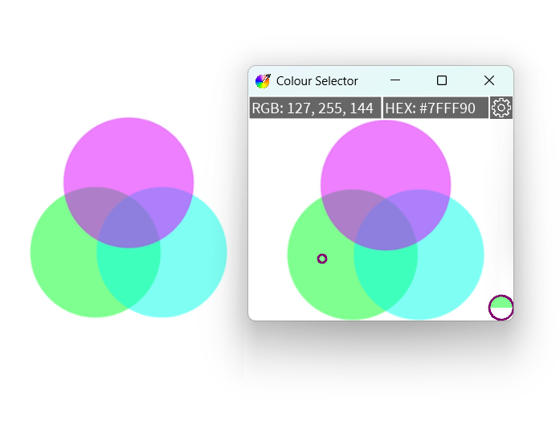

# ColourSelecter
A personal project in Processing 4 created out of the need to speed up the process of grabbing colour values off images for use in projects. 
The program allows the user to copy the HEX or RGB values from a preview window of their screen.

